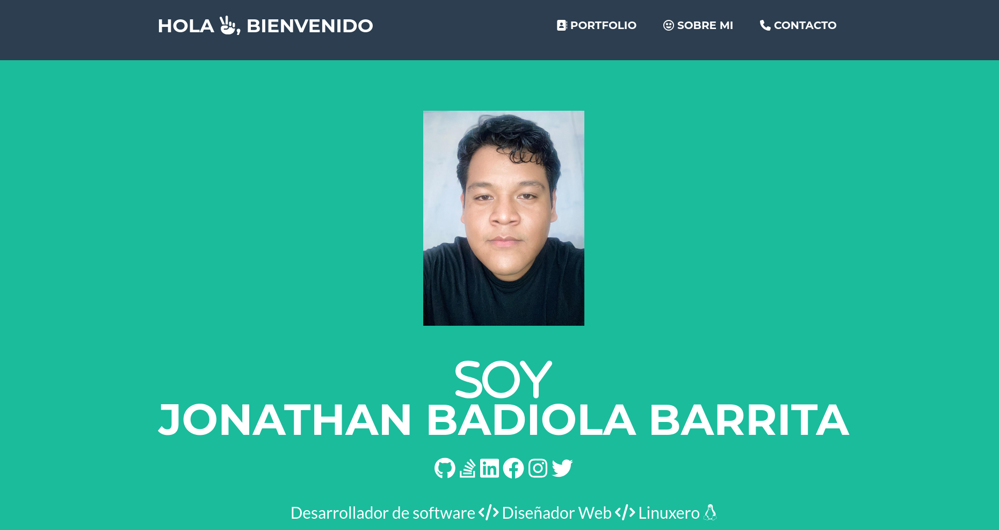
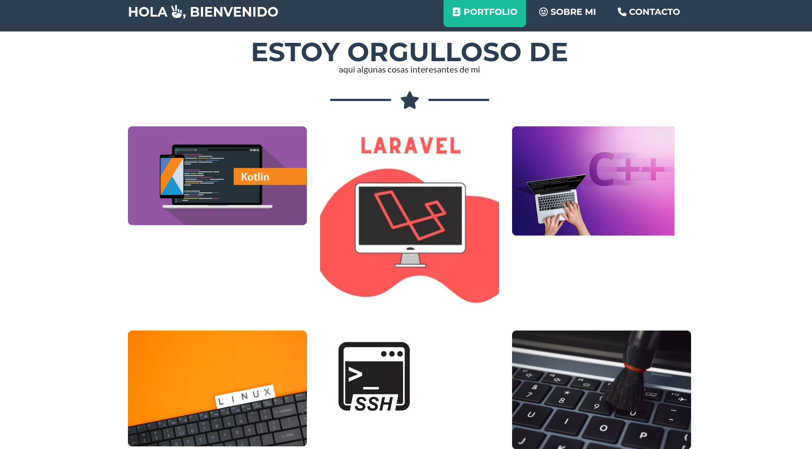
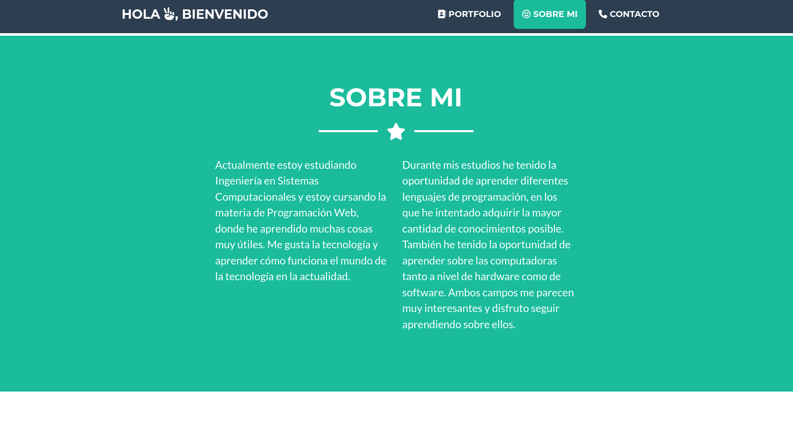
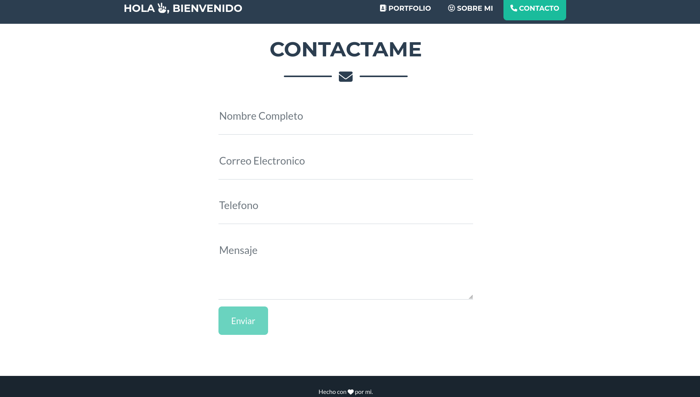

# Portafolio Personal con Bootstrap 5

## Información del proyecto

**Materia:** Programación Web  
**Alumno:** Badiolajh Barrita Jonathan
**Proyecto:** Portafolio Personal con Bootstrap 5

### Descripción

Este proyecto consiste en el desarrollo de un portafolio web responsivo utilizando el framework **Bootstrap 5**. Se tomó como base la plantilla **Freelancer** de Start Bootstrap, la cual fue personalizada para adaptarla a un portafolio personal, agregando información académica, proyectos realizados, habilidades y medios de contacto.

---

# Framework y plantilla utilizada

- **Framework CSS:** Bootstrap 5
- **Plantilla:** Start Bootstrap - Freelancer

Plantilla original:

https://startbootstrap.com/theme/freelancer

La plantilla fue utilizada como punto de partida debido a su diseño moderno, responsivo y fácil de personalizar.

---

# Estructura del portafolio

El portafolio está dividido en las siguientes secciones:

## Inicio (Home)

Es la sección principal del sitio.

Contiene:

- Fotografía del desarrollador.
- Nombre.
- Habilidades.
- Presentación breve.

---

## Sobre mí (About Me)

En esta sección se presenta una descripción personal sobre mi.

Incluye información sobre:

- Estudios actuales.
- Intereses en el desarrollo de software.
- Tecnologías aprendidas.
- Objetivos profesionales.

---

## Portafolio (Projects)

Aquí se muestran algunos de los proyectos desarrollados durante la carrera.

Cada proyecto cuenta con una imagen representativa y una breve descripción.

Entre ellos se encuentran:

- Android
- Laravel
- Linux
- SSH
- Mantenimiento
- Simondice

---

## Contacto

Permite que otras personas puedan comunicarse con el desarrollador.

Contiene un formulario con los siguientes campos:

- Nombre
- Correo electrónico
- Número telefónico
- Mensaje

---

# Proceso de creación

Para desarrollar este proyecto se siguieron los siguientes pasos:

1. Se descargó la plantilla **Freelancer** desde Start Bootstrap.

2. Se analizó la estructura del proyecto para identificar los archivos HTML, CSS, JavaScript e imágenes.

3. Se personalizó la página principal sustituyendo la información de ejemplo por información personal.

4. Se reemplazó la fotografía predeterminada por una fotografía del desarrollador.

5. Se modificó la sección **About** para incluir una descripción personal y académica.

6. Se sustituyeron las imágenes del portafolio por imágenes correspondientes a proyectos propios.

7. Se actualizaron los títulos y descripciones de cada proyecto.

8. Se personalizó la sección de contacto.

9. Se verificó que todas las rutas de imágenes utilizaran rutas relativas para asegurar la compatibilidad con GitHub Pages.

10. Finalmente, el proyecto fue publicado en GitHub.

---

# Capturas del proyecto

## Pantalla de inicio

---

## Sección Sobre mí

---

## Información adicional

---

## Formulario de contacto

---

# Tecnologías utilizadas

- HTML5
- CSS3
- Bootstrap 5
- JavaScript
- Git
- GitHub

---

# Git Pages
